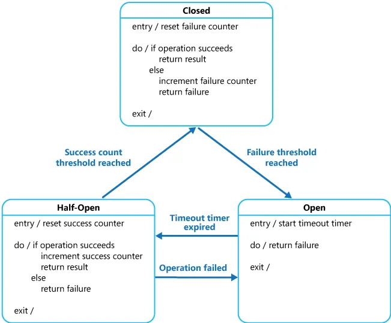
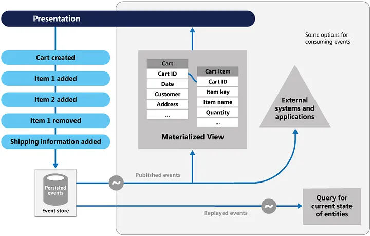
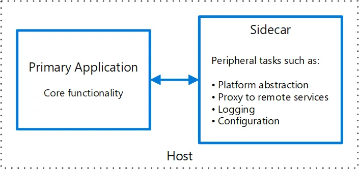
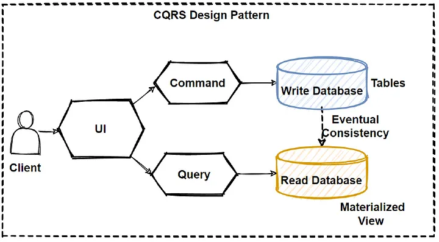
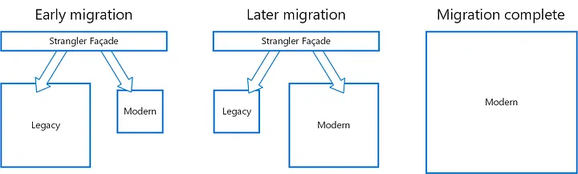
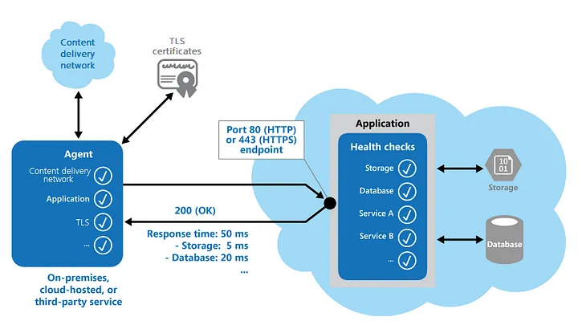

= 7 Architecture Design Patterns — You wish you knew before interview

If you landed on this blog, I believe you know what modern architecture design patterns are. But for some of our less experienced friends here, think of architecture design patterns as the way you design your application(s) such that they scale and don’t need your resignation for that.

____

Architecture Design Patterns, in a nutshell, are design patterns for High Level Design.

____

Modern problems demand modern solutions. For applications to cater to enterprises or even an internet-level audience, they need to be scalable, available, secure, and resilient. Without a doubt, all major league companies are looking for developers who can grasp and solve these difficulties.

The question now is: how do developers solve these problems? One way is to follow good architectural design patterns. Here I present you 7 deadly Sins:-

= Circuit Breaker Pattern

Michael Nygard’s book, https://pragprog.com/titles/mnee2/[Release It!], popularized the Circuit Breaker pattern, which can prevent an application from continually attempting to execute an action that is likely to fail, allowing it to proceed without waiting for the problem to be corrected or spending CPU cycles while determining the fault’s duration.

The Circuit Breaker pattern also allows an application to determine whether or not the issue has been remedied. If the problem appears to be resolved, the program can attempt to perform the operation.

____

The Circuit Breaker pattern serves a distinct purpose than the Retry pattern. The Retry pattern allows an application to retry an operation in the hope that it will succeed the next time.

____

The Circuit Breaker design prohibits an application from doing a risky activity. An application can use the Retry pattern to trigger an action through a circuit breaker to combine these two patterns. The retry logic, on the other hand, should be alert to any exceptions supplied by the circuit breaker and should cease repeat attempts if the circuit breaker indicates that a fault is not temporary.

= Event Sourcing Pattern

Most apps operate with data, and the common method is for the program to keep the data in its present state by updating it when users interact with it. In the classic create, read, update, and delete (CRUD) architecture, for example, a typical data operation is to receive data from the store, make some changes to it, and then update the current state of the data with the new values— often by utilizing transactions that lock the data.

The Event Sourcing design defines a method for handling data activities that are triggered by a series of events, each of which is recorded in an append-only store. Application code delivers a series of events to the event store, where they are persisted, that must describe each action that has occurred on the data. Each event describes a collection of data changes (for example, _"AddedItemToOrder"_).

The events are saved in an event store, which serves as the system of record (the official data source) for the data’s present state. These events are often published by the event retailer so that consumers are aware and can handle them if necessary. Consumers may, for example, start tasks that apply the operations in the events to other systems, or they could execute any other associated action required to finish the process. It’s worth noting that the application code that generates the events is separate from the systems that subscribe to them.

= SideCar Pattern

Monitoring, logging, configuration, and networking services are frequently required by applications and services. These extraneous chores might be carried out as distinct components or services.

A sidecar service is not always part of the application, but it is linked to it. It follows the parent application everywhere it goes. Sidecars are procedures or services that are delivered alongside the principal application. The sidecar on a motorbike is coupled to one motorcycle, and each motorcycle can have its own sidecar. A sidecar service, similarly, mirrors the fate of its parent application. A sidecar instance is deployed and hosted alongside each instance of the application.

They can execute in the same process as the application if they are tightly integrated, making optimal use of shared resources. This, however, implies that they are not properly separated, and a failure in one of these components can affect other components or the entire application. Furthermore, they must normally be written in the same language as the parent program. As a result, the component and the application are highly dependent on one another.

= CQRS

CQRS stands for Command and Query Responsibility Segregation, a pattern that isolates data store read and update processes. CQRS implementation in your application can improve its performance, scalability, and security. The flexibility gained by moving to CQRS enables a system to evolve more effectively over time and prevents update instructions from triggering merge conflicts at the domain level.

Separate query and update models make design and implementation easier. although, CQRS code cannot be automatically generated from a database schema using scaffolding techniques such as O/RM tools (although, you can add your customised on top of the generated code).

You can physically split the read and write data for more isolation. In that instance, the read database can utilise its own query-optimized data schema. It can, for example, store a materialised view of the data to avoid complex joins or O/RM mappings. It may even employ a different sort of data storage. For example, the write database could be relational, and the read database could be a document database.

= Rate Limiting Pattern

To prevent excessive resource consumption, some services impose limits on how fast other applications or services can access them. This is called throttling. You can use a rate limiting pattern to reduce or avoid throttling errors caused by these limits and to estimate throughput more accurately.

A rate-limiting pattern can be useful in many situations, but it is especially helpful for large-scale repetitive automated tasks such as batch processing.

By limiting the amount of records supplied to a service during a specific time, rate limiting can lower your traffic and possibly increase throughput.

Various measures may be used to throttle a service over time, including:

— the quantity of actions (60 requests, for instance).
— the volume of data (50 GB per minute, for instance).
— the relative expense of operations (42,000 RUs per second, for instance).

Regardless of the metric employed for throttling, the rate limiting approach you choose will include regulating the volume and/or size of operations delivered to the service over a predetermined time frame in order to maximize your use of the service without going over the throttling limit.

= Strangler Fig

Migrate a legacy system incrementally by gradually replacing certain functionalities with new apps and services. The old system is eventually choked by the new system, which eventually replaces all of the features of the legacy system, enabling you to decommission it.

Replace specific functionalities in stages with fresh software and services. Make a façade that catches requests headed for the legacy backend system. These requests are forwarded by the façade to either the new services or the legacy application. Customers can use the same interface while existing functionality are progressively moved to the new system, completely ignorant of the transition.

This method helps spread out the development work across time and reduce migration risk. You may add functionality to the new system at any rate you like while ensuring the legacy application continues to work because the façade safely directs users to the appropriate application. The legacy system gradually becomes “strangled” and is no longer required over time as features are transferred to the new system. After finishing this procedure, the legacy system can be safely retired.

*Health Endpoint Monitoring Pattern*

The Health Endpoint Monitoring pattern can be used to ensure that programmes and services are operating properly. This pattern outlines how functional checks should be used in an application. Through open endpoints, external tools have regular access to these checks.

Sending requests to an endpoint on your application will enable health monitoring. After running all essential tests, the programme should indicate its state.

Usually, a health monitoring check combines two elements:

When a request is made to a health verification endpoint, the application or service executes checks, if any.
The evaluation of the outcomes by the system or tool that conducts the health verification check
The response code indicates the application’s status. The status of the app’s components and services may optionally be provided in the response code. The latency or reaction time check is carried out by the monitoring tool or framework.

The pattern is seen in the following figure.

