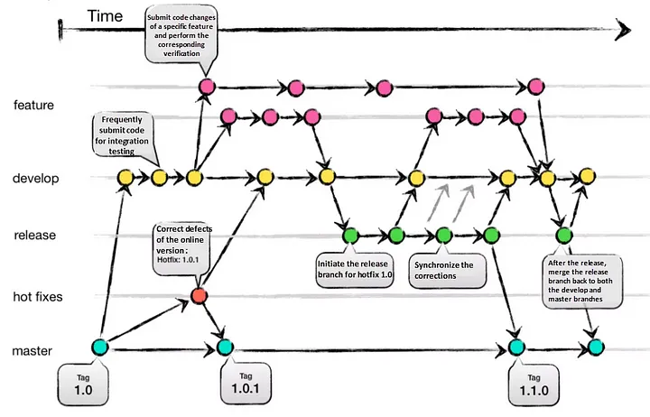
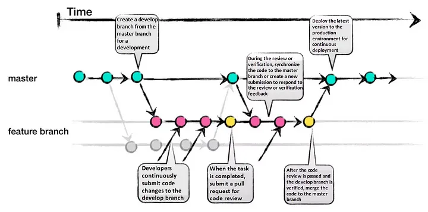
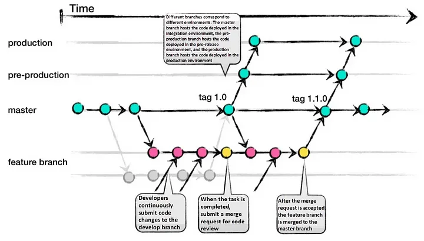
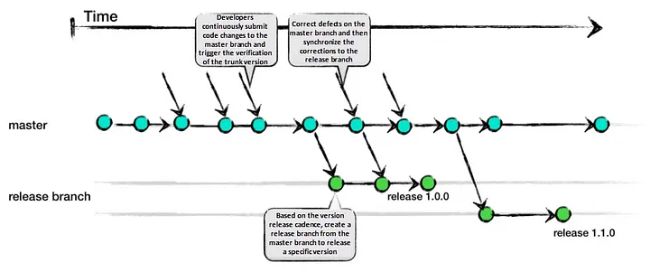

= Choosing the Right Git Branching Strategy: A Comparative Analysis

Effective branch management is crucial for successful collaboration and efficient development with Git. In this article, we will explore four popular branching strategies — Git-Flow, GitHub-Flow, GitLab-Flow, and Trunk Based Development. By understanding their pros, cons, and ideal use cases, you can determine the most suitable approach for your project.

== Git-Flow

Git-Flow is a comprehensive branching strategy that aims to cover various scenarios. It defines specific branch responsibilities, such as main/master for production, develop for active development, feature for new features, release as a gatekeeper to production, and hotfix for addressing urgent issues. The life-cycle involves branching off from develop, integrating features, creating release branches for testing, merging into main/master, and tagging versions.

=== Pros

- Well-suited for large teams and aligning work across multiple teams.
- Effective handling of multiple product versions.
- Clear responsibilities for each branch.
- Allows for easy navigation of production versions through tags.

=== Cons

- Complexity due to numerous branches, potentially leading to merge conflicts.
- Development and release frequency may be slower due to multi-step process.
- Requires team consensus and commitment to adhere to the strategy.

Git-Flow

== GitHub-Flow

GitHub-Flow simplifies Git-Flow by eliminating release branches. It revolves around one active development branch (often main or master) that is directly deployed to production. Features and bug fixes are implemented using long-living feature branches. Feedback loops and asynchronous collaboration, common in open-source projects, are encouraged.

=== Pros

- Faster feedback cycles and shorter production cycles.
- Ideal for asynchronous work in smaller teams.
- Agile and easier to comprehend compared to Git-Flow. 

=== Cons

- Merging a feature branch implies it is production-ready, potentially introducing bugs without proper testing and a robust CI/CD process.
- Long-living branches can complicate the process.
- Challenging to scale for larger teams due to increased merge conflicts.
- Supporting multiple release versions concurrently is difficult.

GitHub-flow

== GitLab-Flow

GitLab-Flow strikes a balance between Git-Flow and GitHub-Flow. It adopts GitHub-Flow’s simplicity while introducing additional branches representing staging environments before production. The main branch still represents the production environment.

=== Pros

- Can handle multiple release versions or stages effectively.
- Simpler than Git-Flow.
- Focuses on quality with a lean approach.

=== Cons

- Complexity increases when maintaining multiple versions.
- More intricate compared to GitHub-Flow.

GitLab-Flow

== Trunk Based Development

Trunk Based Development promotes a single shared branch called “trunk” and eliminates long-living branches. There are two variations based on team size: smaller teams commit directly to the trunk, while larger teams create short-lived feature branches. Frequent integration of smaller feature slices is encouraged to ensure regular merging.

=== Pros

- Encourages DevOps and unit testing best practices.
- Enhances collaboration and reduces merge conflicts.
- Allows for quick releases.

=== Cons

- Requires an experienced team that can slice features appropriately for regular integration.
- Relies on strong CI/CD practices to maintain stability.

Trunk Based Development — TBD

== Conclusion

Each branching strategy — Git-Flow, GitHub-Flow, GitLab-Flow, and Trunk Based Development — offers its own advantages and considerations. Choosing the right strategy depends on your specific project requirements. Git-Flow suits large teams and complex projects, while GitHub-Flow excels in open-source and small team environments. GitLab-Flow provides a compromise between Git-Flow and GitHub-Flow, while Trunk Based Development is ideal for experienced teams focused on collaboration and quick releases. Select the strategy that aligns with your team’s capabilities, project complexity, and desired workflow to maximize efficiency and success.