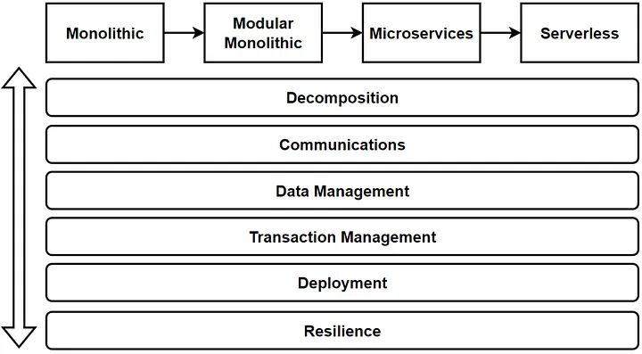

= Microservices Checklist — Cover All Aspects of Microservices Architecture

We are going to learn our *Microservices Checklist* and cover *All Aspects* with exploring *vertical topics* of *Microservices Architecture.*

Vertical Considerations

Before design any architecture, we should *evaluate* and *verify* some *vertical topics* and *question* to our *architecture* in order to make sure that we have *calculated* every *tradeoffs* and *risks* at acceptable level for your project.

== Software Architecture Design

Software architecture is always a *balancing* act *between trade-offs* and *compromises*. There is no single design or architecture that is perfect for every situation. Instead, software architects must *carefully consider* the *trade-offs* and make decisions based on the specific requirements, constraints, and goals of the software system.

For example, a *monolithic architecture* may be simpler and easier to manage, but it may not scale well as the system grows. On the other hand, a *microservices-based architecture* may provide greater scalability and flexibility, but it may be more complex and difficult to manage. https://medium.com/design-microservices-architecture-with-patterns/macro-services-to-nano-services-evolution-of-software-architecture-424f927b63cb["In the previous article, you can read the *Evolution of Architectures; Monolithic, Microservices and Serverless.*"]

The key point is that *there is no single “best” solution* for software architecture, and software architects must constantly *make trade-offs* and *compromises* based on the *specific requirements*, *constraints*, and *goals* of the system. The goal is to find the *right balance* that meets the needs of the system and the stakeholders.

So to verify any architecture, we should think every aspects of design and make sure that cover all *different angle of the design.* During this article, we will discuss which *vertical considerations* could be think when we design microservices architecture.

= Microservices Building Blocks

We can start to discuss Vertical Considerations of microservices architectures. These are:

* *Microservices Decomposition — Breaking Down Microservices*
* *Microservices Communications (Sync / Async Message-Based Communication, API Gws)*
* *Microservices Data Management (Databases / Query / Commands)*
* *Microservices Transaction Management*
* *Microservices Distributed Caching*
* *Microservices Deployments with Containers and Orchestrators*
* *Microservices Resilience with Distributed Logging, Tracing and Health*
* *Microservices Testing; Contract Testing, Integration Testing, E2E Test*
* *Microservices Security; Authentication and Authorization*

with applying microservices design patterns and practices.

image:image-24.png[Alt text]

Vertical Considerations

According to this image, we can evaluate and verify any architecture with checking all these vertical considerations.

= Microservices Building Blocks — Sub Components

Now we can go one more level to identify and check sub components of building blocks. Here you can reach the *sub components* of these *Microservices Building Blocks*:

== Microservices Decomposition — Breaking Down Microservices:

* DDD — Bounded Context
* Business Capabilities

== Microservices Communications:

* Synchronous Communication
* Asynchronous Communication
* Poll-Based Communications

So in this building block, we should also go one more deep level and identify consideration topics as bellowed:

== Microservices Synchronous Communication

* Sync Communication Types: REST / gRPC / GraphQL / WebSocket
* API Gateway Requirements: Discovery, Registry, Route, Aggregation, Composition, Authentication
* Service-to-service Integration Considerations : Backend Microservices / 3rd party calls / B2B Gateways / IoT Devices
* Headless Architecture Decisions: Micro-frontend designs, Edge Functions

== Microservices Asynchronous Communication

* Async Com Types: 1–1 / 1-many (point-to-point / publish-subscribe)
* Async Com Way: Fire&amp;Forget / Callback
* Async Tools: Message Broker / Event Bus / Queue / DLQ
* Async Patterns: Pub-Sub / Fanout / Topic Queue Chain / Event Filters / Rule Engine
* EDA Design Considerations: Event Backbone / Event Queue Topic Design / Real-time Event Streams / Event Filters, Routers, Deserializers / Event Stores

Lets continue with other sub components of Microservices Building Blocks.

== Microservices Data Management (Databases / Query / Commands)

* Database Chooses
* Queries
* Commands — Consistency
* Distributed Transactions
* Caching

So in this building block, we should also go one more deep level and identify consideration topics as bellowed:

== Database Chooses

* DB Types : Relational / NoSQL — Document, Key/Value, Wide Column, Graph, Time Series, DWH
* DB Scale Options : Master-Slave/ Masterless, Replication, Sharding, Read/Write
* DB Capabilities: CDC / Streaming / Sharding / K8s Management DBs / DWH Reporting / Big Data Analysis / AI/ML model processing

== Queries

* API Gateway / Composition / Aggregation / BFF
* CQRS / Materialized View / Event Sourcing / Read Database
* Analytics/AI-ML/Reporting/Real-time stream analysis and processing / Big Data Analysis

== Commands — Consistency

* Consistency: Strict / Eventual Consistency
* CQRS / Write Database / ACID / Event Sourcing / Repayable Snapshot / Single source of truth

== Microservices Distributed Transactions

* Transaction Management: 2PC / SAGA (Orchestrator / Choreography )
* Outbox / Dual Write / Change Data Capture / Message Broker Event Bus / read-after-write consistency
* MS Design : Idempotency / Stateless / Immutable events

== Microservices Distributed Caching

* Cache Type: Static Content (CDN) / In-memory / Distributed
* Cache Settings: Cache Expire / TTL / Hit — Miss — Invalidation

Lets continue with other sub components of Microservices Building Blocks.

== Microservices Deployments with Containers and Orchestrators

* IaC
* Devops CI/CD
* Network Management

So in this building block, we should also go one more deep level and identify consideration topics as bellowed:

== IaC

* Multi-Cloud Deployments — EKS, AKS, GKS
* PaaS, Managed K8s (Openshift), Databases (k8cassandra, ksql), EventBus (Confluence Kafka), Api Gw
* Serverless options, FAAS, Serverless and Edge Functions, CDN

== Devops CI/CD

* Deployments: Containers, Orchestrators, Serverless options, Frameworks: Openshift
* Pipeline Steps, Automation, Devops tools
* Package Management: Helm Charts, Artifactory Hubs, Re-usable container registry
* Deployment Strategy: Blue/Green, Canary, Recreate
* Configurations : Config Server, Encryption, Key Vault Management

== Network Management

* Load Balancing, Ingress, CDN, DNS Management, Cluster Management, Disaster recovery

Lets continue with other sub components of Microservices Building Blocks.

== Microservices Resilience

* Observability / Logging
* Monitoring
* Tracing
* Resilient / Fault Tolerance

So in this building block, we should also go one more deep level and identify consideration topics as bellowed:

== Observability / Logging

* Centralized Logging, Distributed Logging, Dashboards, ELK Stack
* Log Id per Request, Service App Logs, Integration Logs

== Monitoring

* System Monitoring: CPU, Ram
* Application Monitoring: Queue Count, unprocessed messages
* Health Checks : Microservices, Databases, Brokers Event Buses, 3rd party systems

== Tracing

* Distributed Transactions, Transaction Id, Correlation Id, E2E Request Id, Event Id
* OpenTelemetry Compliance: Jeager, Zipkin

== Resilient / Fault Tolerance

* API Call Management : Retry, Circuit Breaker, Bulkhead, Rate limiting, Fault Tolerant
* Kubernetes Patterns &amp; Best Practices : Sidecar, Service Mesh, Service Proxy
* Async Fault Alarms: DLQ, Notifications, Alarms

Lets continue with other sub components of Microservices Building Blocks.

== Microservices Testing; Contract Testing, Integration Testing, E2E Test

* Pre-Deployment Test : Unit / Integration / Contract Test
* Post-Deployment Test : E2E SIT Test / Consumer-Driven Test / Chaos Test

== Microservices Security; Authentication and Authorization

* Authentication
* Identity Servers: Managed (IS4, Keycloak) and Serverless options (Cognito)
* Protocols: OAuth2.0 , OpenIDConnect flows
* Token Types and Claims
* Authorization
* API Gw Authentication flows, Claim based authorizations, RBAC
* Configurations
* Encryption, Key Vault Management
* SSL and TLS, Firewalls
* Audit Logs

== Conclusion

These are created from our team when we design and iterate microservices into our cloud-native enterprise applications and projects. So if you have additional consideration feel free to extend this list with adding new considerations regarding to microservices.