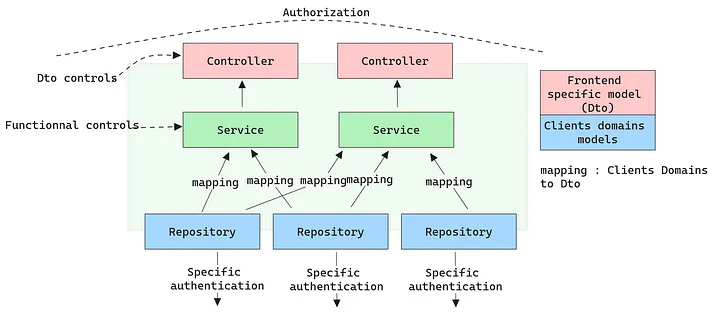

= Architecture Method : C4 Model

= What is the C4 Model?

The C4 model is a framework used in software engineering to visualize and describe the architecture of software systems. Developed by Simon Brown, it stands for “Context, Containers, Components, and Code,” which represent different levels of granularity for depicting a system’s architecture.

== Context

The purpose of this section is to offer a global perspective of the system, highlighting its interactions and connections with external entities such as users, emailing system and other external systems. Here are some keypoints :

*Stakeholders:* Business and system analysts, product owners, team leads, and new team members.

*Strategic Overview:* The context provides a strategic view of the system, highlighting how it fits into and interacts with the broader business environment. This perspective is vital for stakeholders to see the system not as an isolated entity but as a part of a larger business process or ecosystem.

*Clarification of Boundaries:* By outlining the system’s interactions with external entities, the context clarifies the system’s boundaries. This understanding is crucial for identifying potential areas of risk, dependencies, and integration points.

*Guidance for Design and Development:* Understanding the context guides both the design and development of the system. It ensures that the system is aligned with business goals and user needs, making it more effective and user-centric.

*Facilitates Stakeholder Communication:* The context provides a common language and understanding for diverse stakeholders, including business executives, users, and technical teams, fostering better communication and alignment on the system’s objectives. It is a moment when the approach of Domain Driven Design becomes very useful.

image:image-26.png[Alt text]

Example of a context schema

== Containers

This section aims to depict the high-level technological decisions made for the system, detailing key components such as web servers, databases, file systems, and other integral elements that constitute the system’s architecture. Here are some keypoints :

*Stakeholders:* Developers, architects, tech leads and operations teams.

*Architecture Overview:* Containers offer a high-level view of the system architecture, presenting the main technologies and platforms used. This is vital for new team members, external partners, or anyone needing a quick understanding of the system’s technical makeup.

*Decision-Making Framework:* Understanding the containers helps in making informed decisions about scaling, security, and resource allocation. It also aids in evaluating the impact of potential changes or additions to the technology stack.

*Risk Assessment:* By identifying the key technologies and their interactions, it becomes easier to assess and manage risks associated with technology choices, such as vendor lock-in, scalability issues, or security vulnerabilities.

*Optimization Opportunities:* This understanding enables identifying optimization opportunities, such as improving performance, reducing costs, or simplifying the technology stack.

image:image-28.png[Alt text]

Example of a container schema

== Components

This section is designed to provide a deeper understanding of the system’s fundamental components, illustrating the main elements within each container and how they interact with one another. Here are some keypoints :

*Stakeholders:* Development teams (including developers _and_ software architects).

*Detailed Architectural Insight:* Provides a detailed insight into the architectural layout of the system, illustrating how different parts of the system work together. This is critical for both maintaining existing features and planning new development. Here are some keypoints :

*Facilitates Modular Development:* Understanding components aids in modularizing development, allowing teams to work on different parts of the system simultaneously without causing conflicts or dependencies.

*Improves Quality and Maintainability:* A clear view of components allows for better quality control, easier bug tracking, and more efficient maintenance. It also aids in identifying redundant or outdated parts of the system that need refactoring.

*Foundation for Scalability:* A detailed understanding of components is essential for scaling the system effectively, ensuring that each component can handle increased load and complexity.

Example of a component schema for the Back for Frontend component

== Code

This section presents the most detailed layer of the system, focusing on the actual implementation. It typically includes UML diagrams or similar representations to illustrate how the various components of the system are implemented. Here are some keypoints :

*Stakeholders:* Development teams (including developers _and_ software architects).

*Ground-Level Understanding:* Provides the most granular level of understanding, essential for day-to-day development work. It helps developers understand exactly how functionalities are implemented and interact at the code level.

*Enhances Problem-Solving:* With a detailed view of the code, developers can more effectively troubleshoot issues, optimize performance, and ensure code quality.

*Facilitates Onboarding and Knowledge Transfer:* Detailed code documentation is crucial for onboarding new team members, helping them to quickly understand how the system works at a practical, hands-on level.

*Enables Continuous Improvement:* Understanding the code is key to continuous improvement practices like refactoring, as it allows developers to identify areas for enhancement and implement changes without unintended side-effects.

= Benefits

== Clarity

*Comprehensive View:* Offers a multi-level understanding of the system, aiding in strategic planning and reducing errors by highlighting potential design issues early.

*Decision-Making Support:* Enhances informed decision-making regarding design, technology, and resource allocation.

== Communication

*Unified Framework:* Creates a common language for discussions among diverse stakeholders, enhancing collaboration and engagement across teams.

*Stakeholder Alignment:* Improves alignment on project goals and expectations, crucial for project success.

== Documentation

*Systematic Record:* Provides structured, standardized documentation, essential for reference, compliance, and future enhancements. Tools such as ADR (_Architecture Decision Record_) could be very usefull to maintain documentation up to date using a detailed methodology.

*Knowledge Base:* Acts as a valuable knowledge repository for training and guiding new team members. This is a very important point. This kind of knowledge could be a great time saver and also prevent some technical debt from arising.

= Trade-offs

== Complexity

*Detail Overload:* For large systems, capturing every detail can be overwhelming and may obscure the overall understanding. It can also be overkill for small systems.

*Strategic Clarity Risk:* Excessive focus on details can risk losing sight of the high-level strategic view. We all know the tendency we ( developers and architects ) have to over-engineer just because it is fun and satisfying.

== Effort

*Resource Demands:* Requires significant time and effort to create and regularly update, demanding resources that could be allocated elsewhere. So the ROI has to be calculated, a project that is only short term or transitional should not require this kind of investment.

*Maintenance Challenge:* Keeping documentation current with system changes is a continuous and often resource-intensive task, so again focus on the ROI.

== Detail Management

*Balance Difficulty:* Achieving the right level of detail without overcomplicating or oversimplifying is challenging. You need experienced resources, especially in architecture.

*Varied Needs:* Tailoring documentation to meet different stakeholder needs without redundancy or confusion requires careful consideration. Again, you need to rely on an experienced architect who can guarantee this.

= Conclusion

In conclusion, the structured approach of documenting and understanding software systems through Context, Containers, Components, and Code offers significant benefits. This multi-level perspective is crucial for a thorough understanding of the system, aiding in decision-making, stakeholder engagement and effective project management. It serves as a vital knowledge base and a standardized framework for discussions and alignment among various stakeholders.

However, these benefits come with trade-offs. The complexity of maintaining such detailed documentation can be overwhelming, especially for large or rapidly evolving systems. The effort required to create and update these models is substantial and demands significant resources. Additionally, managing the level of detail in documentation to cater to varied stakeholder needs without causing information overload or confusion presents an ongoing challenge.

Therefore, while this approach is highly beneficial for understanding and communicating the architecture of software systems, it requires careful consideration and management to ensure that the documentation remains effective, relevant, and accessible to all stakeholders. Balancing the depth of detail with the high-level overview, and allocating resources efficiently for ongoing maintenance, are key to leveraging the full potential of this structured architectural approach.