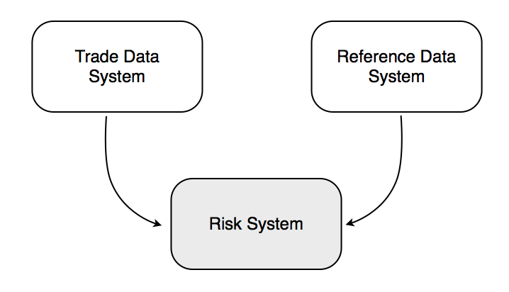

== Functional Overview

The high-level functional requirements for the new Risk System are as follows.

. Import trade data from the Trade Data System.
. Import counterparty data from the Reference Data System.
. Join the two sets of data together, enriching the trade data with information about the counterparty.
. For each counterparty, calculate the risk that the bank is exposed to.
. Generate a report that can be imported into Microsoft Excel containing the risk figures for all counterparties known by the bank.
. Distribute the report to the business users before the start of the next trading day (9am) in Singapore.
. Provide a way for a subset of the business users to configure and maintain the external parameters used by the risk calculations.